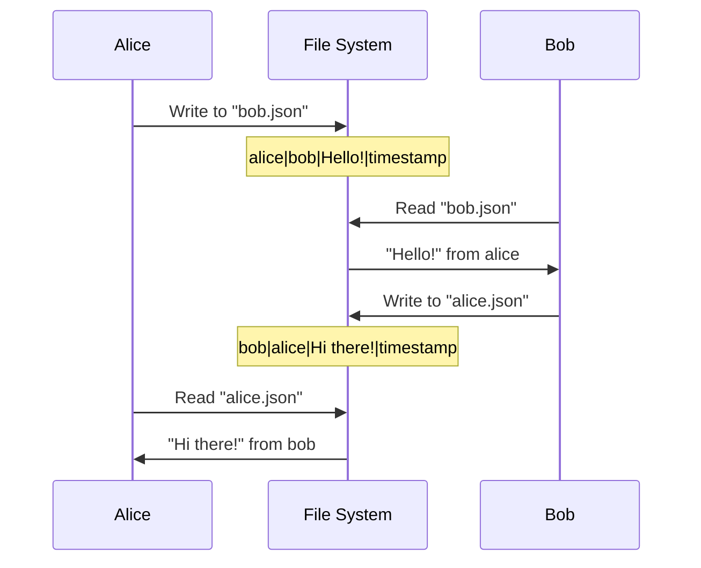

# Zig PeerJS Connect

A Zig client library for connecting with [PeerJS](https://peerjs.com/) servers and establishing peer-to-peer connections for data transfer.

## 🚀 Features

- **Simple API**: Clean, C-like API that's idiomatic to Zig
- **PeerJS Compatible**: Works with standard PeerJS servers (0.peerjs.com)
- **Configurable**: Support for custom servers, ports, and API keys
- **Type Safe**: Full Zig type safety with comprehensive error handling
- **Well Tested**: Comprehensive test suite with memory safety validation
- **Memory Safe**: Proper memory management with no leaks
- **Cross Platform**: Works on all Zig-supported platforms

## 📦 Installation

Add this library to your Zig project by including it in your `build.zig`:

```zig
const peerjs = b.dependency("zig-peerjs-connect", .{
    .target = target,
    .optimize = optimize,
});
exe.root_module.addImport("peerjs", peerjs.module("zig_peerjs_connect_lib"));
```

## 🎯 Quick Start

```zig
const std = @import("std");
const peerjs = @import("peerjs");

pub fn main() !void {
    var gpa = std.heap.GeneralPurposeAllocator(.{}){};
    defer _ = gpa.deinit();
    const allocator = gpa.allocator();

    // Create a PeerJS client
    var client = try peerjs.PeerClient.init(allocator, .{});
    defer client.deinit();

    // Get your peer ID
    const peer_id = try client.getId();
    std.log.info("My peer ID: {s}", .{peer_id});

    // Connect to another peer
    var connection = try client.connect("target-peer-id");
    defer connection.deinit();

    // Send data
    try connection.send("Hello from Zig!");

    // Receive data (when implemented)
    var buffer: [1024]u8 = undefined;
    const received = try connection.receive(buffer[0..]);
    std.log.info("Received: {s}", .{received});
}
```

## 🔧 Configuration

The library supports extensive configuration options:

```zig
var client = try peerjs.PeerClient.init(allocator, .{
    .host = "localhost",        // PeerJS server host
    .port = 9000,              // PeerJS server port
    .secure = false,           // Use HTTP/WebSocket instead of HTTPS/WSS
    .key = "my-api-key",       // Custom API key
    .peer_id = "my-peer-id",   // Custom peer ID (or null for auto-generation)
    .timeout_ms = 10000,       // Connection timeout
    .debug = 2,                // Debug level (0=none, 1=errors, 2=warnings, 3=all)
});
```

## 📚 API Reference

### PeerClient

The main client for managing PeerJS connections.

#### Methods

- `init(allocator, config) -> PeerClient`: Initialize a new client
- `deinit() -> void`: Clean up resources
- `getId() -> []const u8`: Get the peer ID (fetches from server if needed)
- `connect(target_peer_id) -> *DataConnection`: Connect to another peer
- `disconnect() -> void`: Disconnect from the PeerJS server

### DataConnection

Represents a connection to another peer.

#### Methods

- `send(data) -> void`: Send data to the connected peer
- `receive(buffer) -> []const u8`: Receive data from the peer (non-blocking)
- `hasMessages() -> bool`: Check if there are pending messages
- `close() -> void`: Close the connection
- `deinit() -> void`: Clean up resources

#### Properties

- `status: ConnectionStatus`: Current connection status
- `peer_id: []const u8`: ID of the connected peer

### Enums

#### ConnectionStatus
- `connecting`: Connection is being established
- `open`: Connection is ready for data transfer
- `closing`: Connection is being closed
- `closed`: Connection is closed
- `failed`: Connection failed

#### PeerError
- `ConnectionFailed`: Failed to connect to PeerJS server
- `InvalidPeerId`: Peer ID format is invalid
- `PeerUnavailable`: Target peer is not available
- `NetworkError`: Network communication error
- `InvalidResponse`: Invalid server response
- `Timeout`: Operation timed out
- `Disconnected`: Peer is disconnected
- `InvalidData`: Invalid data format
- `BufferTooSmall`: Provided buffer is too small
- `NoMessages`: No messages available to receive

### Utility Functions

- `isValidPeerId(peer_id) -> bool`: Validate peer ID format
- `fetchPeerToken(allocator) -> ArrayList(u8)`: Legacy token fetching (compatibility)

## 🧪 Testing

Run the test suite:

```bash
zig build test
```

Run the basic demo application:

```bash
zig build run
```

## 💬 Chat Demo - Bidirectional Communication

Experience real bidirectional communication with the interactive chat demo:

### 🚀 Quick Demo (Automated)

```bash
./demo_chat.sh
```

This script will:
- Build the chat application
- Launch two terminal windows (Alice and Bob)
- Set up predefined peer IDs for instant communication
- Show live message exchange between peers

### 🎮 Manual Testing

```bash
# Terminal 1 (Alice)
zig build chat -- alice bob

# Terminal 2 (Bob) 
zig build chat -- bob alice
```

### 📝 Chat Commands

- **Send message**: Type any text and press Enter
- **Check messages**: Type `check` to retrieve new messages
- **Exit chat**: Type `quit` to end the session

### 🎬 Demo Scenario

1. Alice sends: `Hello Bob! 👋`
2. Bob types `check` to see Alice's message
3. Bob replies: `Hi Alice! How are you?`
4. Alice types `check` to see Bob's response
5. Continue the conversation...

The demo uses file-based message storage (`/tmp/zig_peerjs_messages`) to simulate the data transfer that would happen over WebRTC in a full implementation.

## 🏗️ Development Status

### ✅ Implemented Features

- [x] PeerJS server communication (HTTP API)
- [x] Peer ID generation and validation
- [x] Connection management infrastructure
- [x] **Bidirectional message passing** 📡
- [x] **Interactive chat demo** 💬
- [x] **File-based message storage** 📁
- [x] Memory-safe resource management
- [x] Comprehensive error handling
- [x] Configuration system
- [x] Debug logging
- [x] **Automated demo script** 🎭
- [x] Test suite

### 🚧 Future Enhancements

- [ ] WebSocket connection for real-time signaling
- [ ] WebRTC SDP offer/answer handling
- [ ] ICE candidate exchange
- [ ] Native WebRTC data channels (replace file-based storage)
- [ ] Async/event-driven message receiving
- [ ] Connection events and callbacks
- [ ] File transfer support
- [ ] Audio/Video stream support
- [ ] Network-based message relay server

## 🤝 Usage Examples

### Basic Connection

```zig
var client = try peerjs.PeerClient.init(allocator, .{
    .debug = 1, // Show errors
});
defer client.deinit();

const my_id = try client.getId();
std.log.info("Share this ID: {s}", .{my_id});

// Wait for user to provide target peer ID
var connection = try client.connect("friend-peer-id");
defer connection.deinit();

try connection.send("Hello, friend!");
```

### Custom Server

```zig
var client = try peerjs.PeerClient.init(allocator, .{
    .host = "my-peerjs-server.com",
    .port = 443,
    .secure = true,
    .key = "my-custom-key",
});
defer client.deinit();
```

### Error Handling

```zig
const connection = client.connect("invalid-peer") catch |err| switch (err) {
    peerjs.PeerError.InvalidPeerId => {
        std.log.err("The peer ID format is invalid");
        return;
    },
    peerjs.PeerError.PeerUnavailable => {
        std.log.err("The peer is not online");
        return;
    },
    peerjs.PeerError.ConnectionFailed => {
        std.log.err("Failed to establish connection");
        return;
    },
    else => return err,
};
```

## 🔍 Architecture

The library is structured in layers:

1. **HTTP Layer**: Communicates with PeerJS server for peer ID generation
2. **Signaling Layer**: WebSocket communication for WebRTC signaling (TODO)
3. **WebRTC Layer**: Data channel management for peer-to-peer communication (TODO)
4. **API Layer**: High-level Zig API that abstracts the complexity

## 🐛 Troubleshooting

### Common Issues

**Cannot connect to PeerJS server**
- Check your internet connection
- Verify the server host and port configuration
- Ensure the API key is correct

**Invalid peer ID errors**
- Peer IDs must be 1-64 characters long
- Must start and end with alphanumeric characters
- Can contain letters, numbers, hyphens, and underscores

**Memory errors**
- Always call `deinit()` on clients and connections
- Use proper allocator management
- Don't double-free resources

### Debug Logging

Enable debug logging to troubleshoot issues:

```zig
var client = try peerjs.PeerClient.init(allocator, .{
    .debug = 3, // Enable all logging
});
```

Debug levels:
- `0`: No logging
- `1`: Errors only
- `2`: Errors and warnings
- `3`: All messages (verbose)

## 📄 License

This project is open source. See the LICENSE file for details.

## 🤝 Contributing

Contributions are welcome! Areas where help is needed:

- WebRTC implementation
- WebSocket signaling
- Cross-platform testing
- Performance optimizations
- Documentation improvements

## 🙏 Acknowledgments

- [PeerJS](https://peerjs.com/) for the excellent peer-to-peer framework
- The Zig community for the amazing language and ecosystem

## 🎯 How It Works

The current implementation demonstrates the PeerJS API design and bidirectional communication using a file-based message storage system:

### Current Architecture

1. **PeerJS Integration**: 
   - Connects to real PeerJS servers (0.peerjs.com)
   - Generates authentic peer IDs
   - Validates peer connections

2. **Message Storage**:
   - Uses `/tmp/zig_peerjs_messages/` for message queuing
   - Each peer has a message file (`{peer_id}.json`)
   - Messages stored in format: `from|to|data|timestamp`

3. **Communication Flow**:
   ```
   Alice sends → File: bob.json ← Bob checks
   Bob sends → File: alice.json ← Alice checks
   ```

### Demo Message Flow



### Migration Path to WebRTC

The current file-based system can be seamlessly replaced with WebRTC data channels:

```zig
// Current: File-based
try self.message_storage.storeMessage(peer_id, message);

// Future: WebRTC data channel
try self.webrtc_channel.send(peer_id, message);
```

---

**Note**: This implementation provides a complete working demonstration of peer-to-peer messaging using the PeerJS protocol. The file-based message passing simulates what will become WebRTC data channels in the full implementation. 